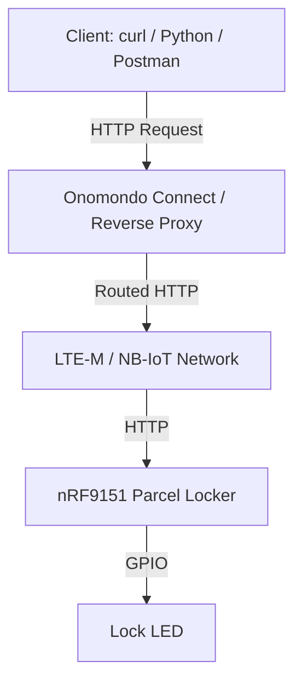

# Cellular Parcel Locker PoC (Standalone nRF Connect SDK Project)

This project is a minimal proof-of-concept for a cellular IoT parcel locker using the Nordic nRF9151. It is designed to be built using the **nRF Connect SDK (NCS)**.

## System Architecture



### Networking Limitation: Cellular NAT
Most cellular networks use Carrier-Grade NAT (CGNAT), meaning the device does not have a public IP address and cannot be reached directly from the internet.
To test this API remotely, we recommend:
1.  **Onomondo Connect:** Provides a private network (VPN) where your device and client are on the same subnet.
2.  **Reverse Tunneling (e.g., WireGuard or custom TCP proxy):** The device establishes an outbound connection to a server with a public IP, which then forwards incoming HTTP traffic back to the device.

## Firmware Architecture

- **LTE Connection Manager:** Handles modem initialization, SIM authentication, and network registration using `lte_lc`.
- **HTTP Server:** Uses the native Zephyr HTTP Server (v3.7+) to expose REST endpoints.
- **Locker State Manager:** A simple in-memory structure tracks the open/closed state of 6 locker compartments.
- **GPIO Driver:** Interacts with the board's LED to simulate the physical lock mechanism.

## API Specification

| Method | Endpoint | Description |
|--------|----------|-------------|
| GET | `/locker/status` | Returns general health and compartment count. |
| GET | `/compartments` | Returns a list of all compartments and their states. |
| POST | `/compartments/0/open` | Triggers the lock on compartment 0 and toggles the LED. |
| GET | `/compartments/0/status` | Returns the current state of compartment 0. |

## Setup Guide (VS Code)

### 1. Initialize Workspace
If you haven't already, install the **nRF Connect for VS Code Extension Pack**.
In a terminal, you can initialize this standalone repository:
```bash
cd /Users/maxxlife/github_repos/cellular-locker-app
west init -l .
west update
```

### 2. Hardware Prerequisites
- nRF9151 Development Kit.
- Onomondo SIM Card (Inserted and activated on `app.onomondo.com`).
- Cellular antenna connected to the DK.

### 3. Build and Flash in VS Code
1. Open the `/Users/maxxlife/github_repos/cellular-locker-app` folder in VS Code.
2. Open the **nRF Connect Extension** from the sidebar.
3. Click **"Create a new application"** or **"Add an existing application"** and select this folder.
4. Click **"Add Build Configuration"**.
5. Select the board: **`nrf9151dk/nrf9151/ns`** (Note: the `ns` suffix is mandatory for cellular apps).
6. Click **"Build Configuration"**.
7. Once finished, click **"Flash"**.

### 4. Verify Connection
Monitor the Serial output (115200 baud):
```text
[00:00:05.000] <inf> locker_app: Network registration status: Connected - roaming
[00:00:15.000] <inf> locker_app: Starting HTTP server on port 80
```

### 5. Test the API
Use the IP address obtained from the modem (you can see it in logs or via `AT+CGPADDR` if using `at_client` earlier):
```bash
curl http://<DEVICE_IP>/locker/status
```

## Scaling to Production

To move from this PoC to a commercial product:
1.  **Security:** Implement **HTTPS (TLS 1.3)** using Zephyr's MbedTLS integration.
2.  **Communication Model:** Switch to **MQTT** or **AWS IoT Core** for production. Direct HTTP servers on cellular devices consume high power as the radio must remain in RRC Connected mode or wake up frequently.
3.  **Power Management:** Optimize using **PSM (Power Saving Mode)** and **eDRX**.
4.  **Hardware:** Add door sensors (buttons) and battery management circuits.
5.  **Provisioning:** Implement an automated way to rotate device certificates and handle FOTA (Firmware Over-the-Air) updates.


### 6. Dealing with Cellular NAT (How to Reach the Device)

Because cellular networks use Carrier-Grade NAT (CGNAT), the device's IP address (e.g., `100.119.103.90`) is a private IP. It is entirely hidden from the public internet[[1](https://www.google.com/url?sa=E&q=https%3A%2F%2Fvertexaisearch.cloud.google.com%2Fgrounding-api-redirect%2FAUZIYQEO_9D8o8Q8huvy3oB85Cb9V8AAU0P1QsdnSP-bJj9qTwPiU34sXb_gJXoUGiomm_QcaNE82mpKsSxR1E6kHB1v1kzA_MqBmqiXlMwgfXIVSuiugJ81NLFwEOxbju7C9Y_V_B1t2gjPxxj3DYA9EQFc_fIwXYIvyA%3D%3D)]. By default, **you cannot curl this IP from your local Wi-Fi.**[[1](https://www.google.com/url?sa=E&q=https%3A%2F%2Fvertexaisearch.cloud.google.com%2Fgrounding-api-redirect%2FAUZIYQEO_9D8o8Q8huvy3oB85Cb9V8AAU0P1QsdnSP-bJj9qTwPiU34sXb_gJXoUGiomm_QcaNE82mpKsSxR1E6kHB1v1kzA_MqBmqiXlMwgfXIVSuiugJ81NLFwEOxbju7C9Y_V_B1t2gjPxxj3DYA9EQFc_fIwXYIvyA%3D%3D)]

To connect to your device's HTTP server for testing, you must connect your computer to **Onomondo's OpenVPN network**[[1](https://www.google.com/url?sa=E&q=https%3A%2F%2Fvertexaisearch.cloud.google.com%2Fgrounding-api-redirect%2FAUZIYQEO_9D8o8Q8huvy3oB85Cb9V8AAU0P1QsdnSP-bJj9qTwPiU34sXb_gJXoUGiomm_QcaNE82mpKsSxR1E6kHB1v1kzA_MqBmqiXlMwgfXIVSuiugJ81NLFwEOxbju7C9Y_V_B1t2gjPxxj3DYA9EQFc_fIwXYIvyA%3D%3D)][[2](https://www.google.com/url?sa=E&q=https%3A%2F%2Fvertexaisearch.cloud.google.com%2Fgrounding-api-redirect%2FAUZIYQEc1h29C017GWwueZwixI5TbJcy0phwpf_qpUGm1kGBO9FHzUyQK_Px5A4LnDFIvr8lFav0JBsWJGkg21cwlQlR49V3NdXu2w6_faI4FoTS5oaqlwatrtPqvTkE1A%3D%3D)][[3](https://www.google.com/url?sa=E&q=https%3A%2F%2Fvertexaisearch.cloud.google.com%2Fgrounding-api-redirect%2FAUZIYQG6gbxNY97esQErqJaonCX4tjsPeqX4O6AEn-fLu9XXalpIScv60x4qikqtqm5MWOXzQ4sdYBFxJiua1k6VSkdNWOk94HPSdrZ1N15tRDPFZmU2IC5Z-wBQoBvB6d8sd8-I3--lC7Deht0O0Ch_FYIqterWCiVBSOU%3D)]. This puts your computer and the nRF9151 on the same virtual subnet, allowing direct, secure two-way communication[[1](https://www.google.com/url?sa=E&q=https%3A%2F%2Fvertexaisearch.cloud.google.com%2Fgrounding-api-redirect%2FAUZIYQEO_9D8o8Q8huvy3oB85Cb9V8AAU0P1QsdnSP-bJj9qTwPiU34sXb_gJXoUGiomm_QcaNE82mpKsSxR1E6kHB1v1kzA_MqBmqiXlMwgfXIVSuiugJ81NLFwEOxbju7C9Y_V_B1t2gjPxxj3DYA9EQFc_fIwXYIvyA%3D%3D)][[3](https://www.google.com/url?sa=E&q=https%3A%2F%2Fvertexaisearch.cloud.google.com%2Fgrounding-api-redirect%2FAUZIYQG6gbxNY97esQErqJaonCX4tjsPeqX4O6AEn-fLu9XXalpIScv60x4qikqtqm5MWOXzQ4sdYBFxJiua1k6VSkdNWOk94HPSdrZ1N15tRDPFZmU2IC5Z-wBQoBvB6d8sd8-I3--lC7Deht0O0Ch_FYIqterWCiVBSOU%3D)][[4](https://www.google.com/url?sa=E&q=https%3A%2F%2Fvertexaisearch.cloud.google.com%2Fgrounding-api-redirect%2FAUZIYQF1iyOXwUMCbjr2dvSYtUg1Oauvuhq2u_yIil3Rp55KpMyXDXD1E9lDJeSQZRBV6kYY5TXl3i2gFXZca24-C2lILDuMpOpCN_fKQTdlH-rfghXfUROvSWrZg5wLdgx3og3sGHlp718%3D)].

#### Setting up the Onomondo VPN:

1. **Install an OpenVPN Client**
   * **macOS:** Download and install [Tunnelblick](https://tunnelblick.net/) or the official OpenVPN Connect app.
   * **Windows/Linux:** Download the official [OpenVPN Client](https://openvpn.net/client/).

2. **Enable VPN Access for Your User**
   * Log into the[Onomondo Dashboard](https://app.onomondo.com).
   * Navigate to the **Users** page[[2](https://www.google.com/url?sa=E&q=https%3A%2F%2Fvertexaisearch.cloud.google.com%2Fgrounding-api-redirect%2FAUZIYQEc1h29C017GWwueZwixI5TbJcy0phwpf_qpUGm1kGBO9FHzUyQK_Px5A4LnDFIvr8lFav0JBsWJGkg21cwlQlR49V3NdXu2w6_faI4FoTS5oaqlwatrtPqvTkE1A%3D%3D)].
   * Ensure your user account has "VPN access" enabled (If you are the Owner or Admin, you have unrestricted access by default. Members need specific tags assigned)[[2](https://www.google.com/url?sa=E&q=https%3A%2F%2Fvertexaisearch.cloud.google.com%2Fgrounding-api-redirect%2FAUZIYQEc1h29C017GWwueZwixI5TbJcy0phwpf_qpUGm1kGBO9FHzUyQK_Px5A4LnDFIvr8lFav0JBsWJGkg21cwlQlR49V3NdXu2w6_faI4FoTS5oaqlwatrtPqvTkE1A%3D%3D)].
   * Ensure you have a password set up for your Onomondo account (SSO/Google Login alone won't work for the VPN; you need an actual password)[[2](https://www.google.com/url?sa=E&q=https%3A%2F%2Fvertexaisearch.cloud.google.com%2Fgrounding-api-redirect%2FAUZIYQEc1h29C017GWwueZwixI5TbJcy0phwpf_qpUGm1kGBO9FHzUyQK_Px5A4LnDFIvr8lFav0JBsWJGkg21cwlQlR49V3NdXu2w6_faI4FoTS5oaqlwatrtPqvTkE1A%3D%3D)].

3. **Download the Configuration File**
   * Download the `onomondo.ovpn` configuration file from the Onomondo Documentation or Dashboard (usually found under the Network or API/OpenVPN sections)[[2](https://www.google.com/url?sa=E&q=https%3A%2F%2Fvertexaisearch.cloud.google.com%2Fgrounding-api-redirect%2FAUZIYQEc1h29C017GWwueZwixI5TbJcy0phwpf_qpUGm1kGBO9FHzUyQK_Px5A4LnDFIvr8lFav0JBsWJGkg21cwlQlR49V3NdXu2w6_faI4FoTS5oaqlwatrtPqvTkE1A%3D%3D)].

4. **Connect to the Network**
   * Open your OpenVPN client and import the `onomondo.ovpn` profile[[2](https://www.google.com/url?sa=E&q=https%3A%2F%2Fvertexaisearch.cloud.google.com%2Fgrounding-api-redirect%2FAUZIYQEc1h29C017GWwueZwixI5TbJcy0phwpf_qpUGm1kGBO9FHzUyQK_Px5A4LnDFIvr8lFav0JBsWJGkg21cwlQlR49V3NdXu2w6_faI4FoTS5oaqlwatrtPqvTkE1A%3D%3D)].
   * Click **Connect**.
   * When prompted for credentials, use your **Onomondo login email and password**[[2](https://www.google.com/url?sa=E&q=https%3A%2F%2Fvertexaisearch.cloud.google.com%2Fgrounding-api-redirect%2FAUZIYQEc1h29C017GWwueZwixI5TbJcy0phwpf_qpUGm1kGBO9FHzUyQK_Px5A4LnDFIvr8lFav0JBsWJGkg21cwlQlR49V3NdXu2w6_faI4FoTS5oaqlwatrtPqvTkE1A%3D%3D)].
   * Once connected, your computer's internet traffic destined for `100.64.0.0/10` IP addresses will be routed directly to Onomondo's core network.

5. **Test the Connection**
   You should now be able to ping your device and run the curl commands successfully:
   ```bash
   ping 100.119.103.90
   curl http://100.119.103.90/locker/status