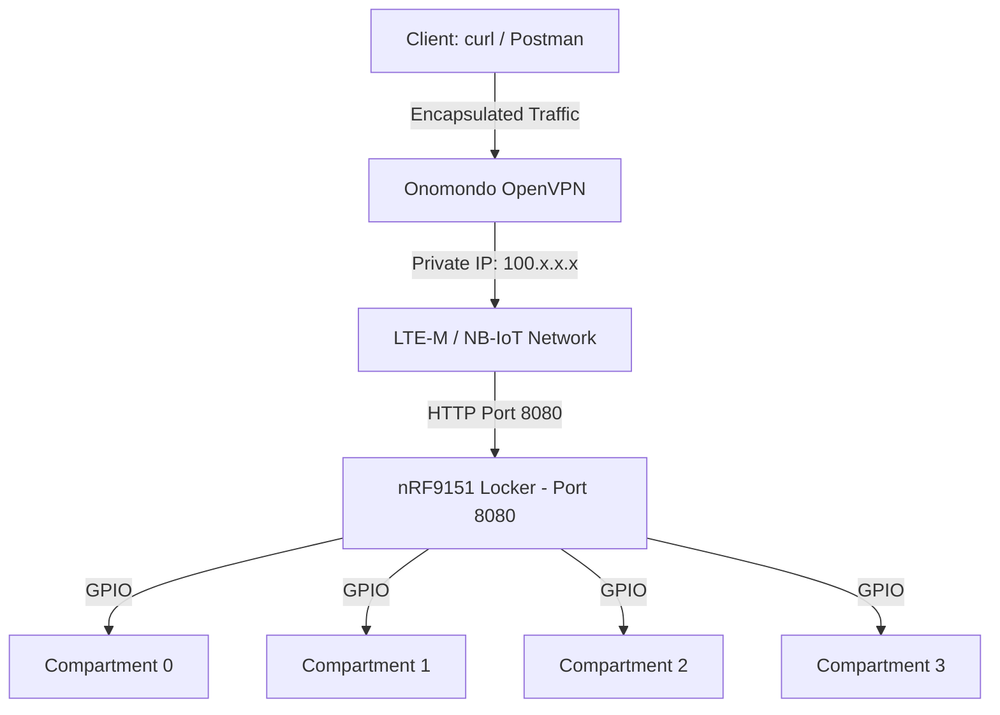

# Cellular Parcel Locker PoC (nRF9151)

This project is a minimal, standalone proof-of-concept for a cellular IoT parcel locker. Built using the **nRF Connect SDK (NCS)**, it utilizes a Nordic nRF9151 and an Onomondo SIM to expose a RESTful HTTP API over an LTE-M/NB-IoT network. 

The firmware controls 4 physical locker compartments, simulated by the 4 onboard LEDs on the nRF9151 Development Kit.

---

## System Architecture

Because cellular networks rely on Carrier-Grade NAT (CGNAT), the device's IP is hidden from the public internet. To communicate with the HTTP server running on the nRF9151, clients must route traffic through a private VPN (e.g., Onomondo Connect).



## Setup & Flashing (VS Code)

### Prerequisites
* **Hardware:** nRF9151 DK, cellular antenna, and an activated Onomondo SIM card.
* **Software:** nRF Connect for VS Code Extension Pack.
* **Network:** OpenVPN client connected to the Onomondo private network (to bypass CGNAT).

### Build Instructions
1. Initialize the workspace:
   ```bash
   west init -l .
   west update

1. Open the folder in VS Code and navigate to the nRF Connect Extension.
2. Add a new Build Configuration for the board: `nrf9151dk/nrf9151/ns` (the `ns` non-secure suffix is mandatory).
3. Build and Flash to the DK.
4. Monitor the serial terminal (115200 baud) to find the device's private IP address once it registers to the LTE network.

## API Specification

The Zephyr HTTP server listens on Port 8080.

| Method | Endpoint | Description |
| :--- | :--- | :--- |
| GET | /locker/status | Returns general health, locker ID, and total compartment count. |
| GET | /compartments | Returns a JSON array of all 4 compartments and their states (open or closed). |
| POST | /compartments/{id}/open | Turns the corresponding LED ON and sets the state to open. |
| POST | /compartments/{id}/close | Turns the corresponding LED OFF and sets the state to closed. |

(Note: {id} must be an integer between 0 and 3).

## Usage Examples

Check the health of the locker:
```bash
curl http://<DEVICE_IP>:8080/locker/status
```   

```bash
curl http://<DEVICE_IP>:8080/compartments
```

Open compartment 2:

```bash
curl -X POST http://<DEVICE_IP>:8080/compartments/2/open
```

Close compartment 2:

```bash
curl -X POST http://<DEVICE_IP>:8080/compartments/2/close
```